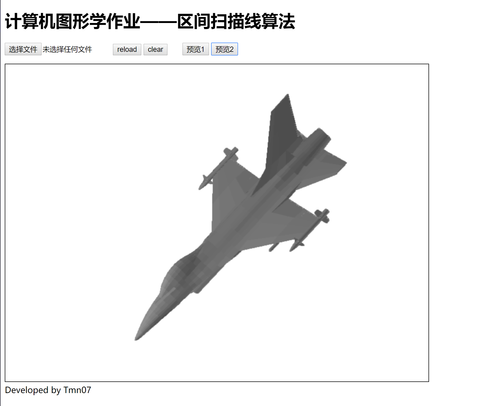
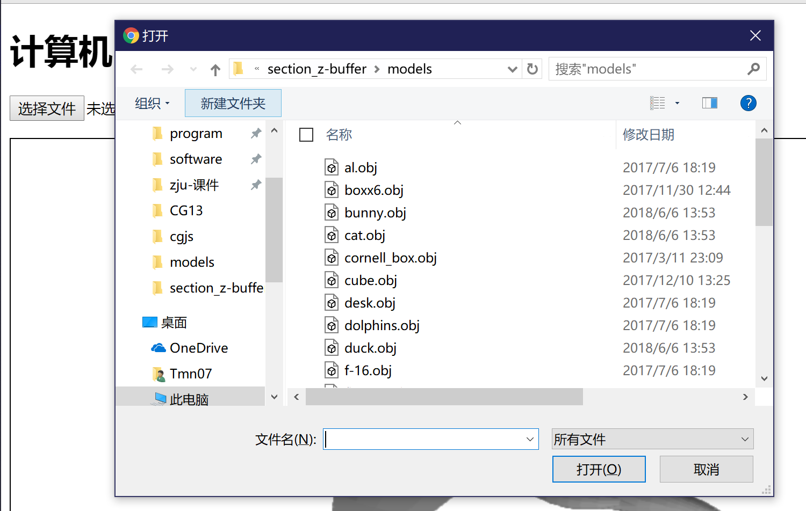

# 区间扫描线算法

## 说明

某浙图形学课程作业 区间扫描线算法 JavaScript canvas绘制版

预览链接: https://git.io/fhnwo



效果还能看..但是几乎没有优化

且目前canvas绘制点速度比较慢，可能是我的姿势不对。在大面积的点的情况下，绘制极慢，占据了大部分的时间..可能区间扫描算法计算出来只要100ms，绘制要500ms..

仓库里只放了两个模型用于预览，要更多的测试，请在本地准备obj文件

没有前端，有想搞得朋友可以写完PR过来2333

（以前写前端的搭档已经年薪半百万了，然而某07穷的都交不起电费了，还要一边赶DDL，一边义务打工...

## 使用方法

页面上就5个按钮还有一些按键事件

"选择文件"(可能会变成英文)按钮：点击后，上传本地的obj模型，然后下面的窗口中就会绘制出模型



**使用按键 W A S D Q E 会分别进行x y z轴的旋转**

reload按钮：点击后，会重新加载当前模型，并回到初始的角度

clear按钮：清空窗口（没什么用

预览1按钮：加载一个6个方块的模型，预览主要是为了方便没有obj文件的朋友测试

预览2按钮：加载一个飞机的模型

如果不在服务器上无法直接使用预览功能(ajax跨域请求不能)，可以简单的在文件夹目录下使用如下指令建立服务器

```python
# python2
python -m SimpleHTTPServer 8080
# python3
python -m http.server 8080
```

然后访问localhost:8080 即可使用预览（其实根本没必要使用，在本地直接上传就是了。主要是我在本地测试时这样弄方便，因为手头也没有其他服务器(apache,nginx啥的)

console中会输出计算过程中消耗的时间，预览需要加载网络资源有时候会慢一点

## TODO

消隐效果提升

区间扫描算法优化

更快速的绘图方案

贯穿模型？